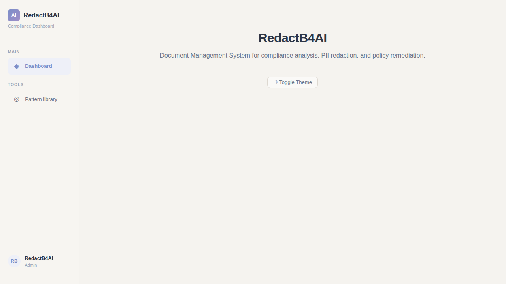
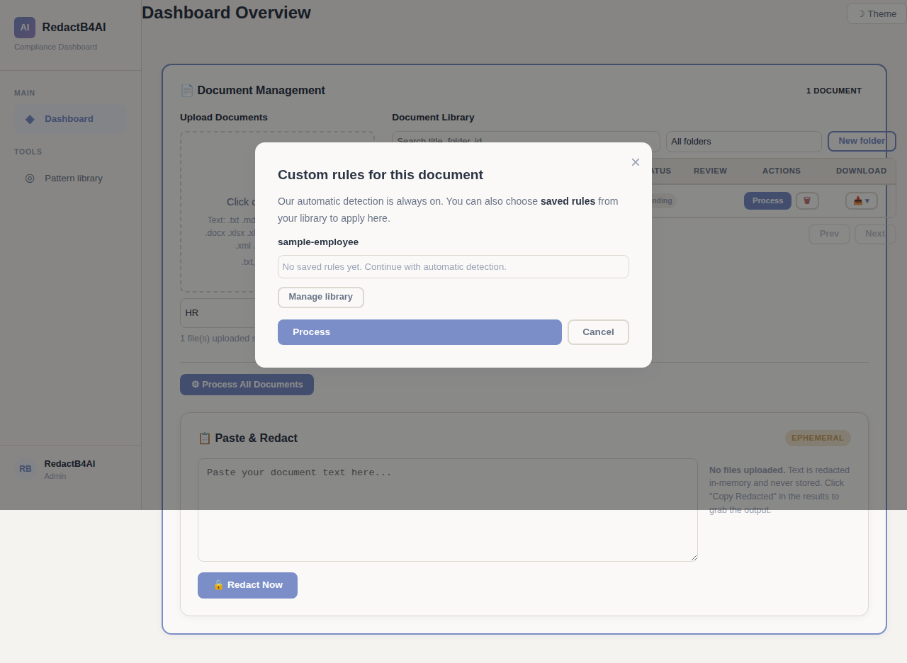
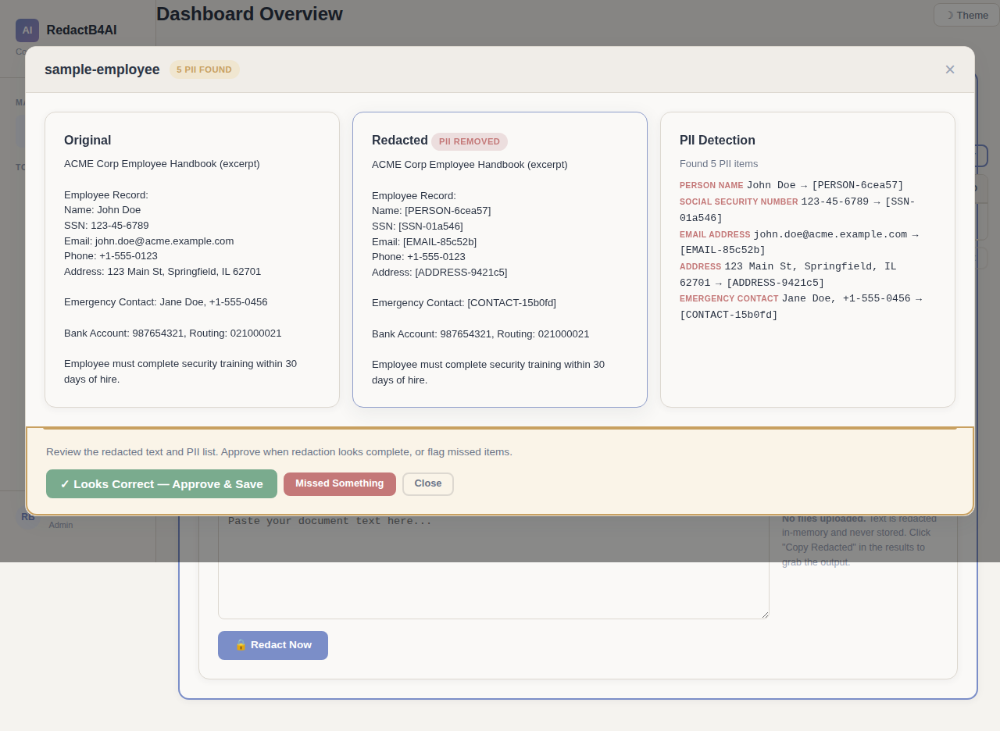
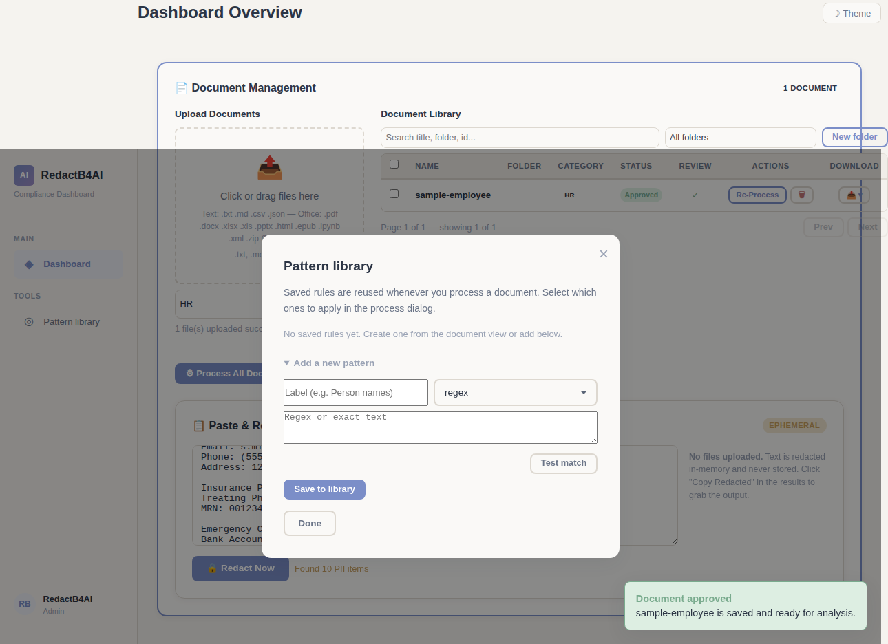
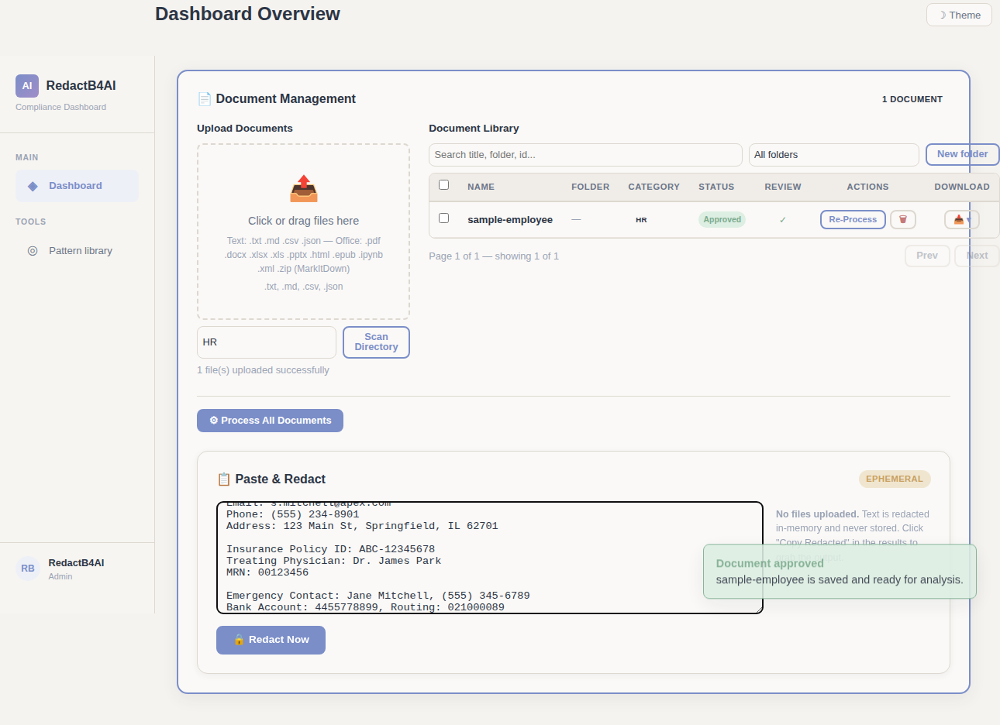
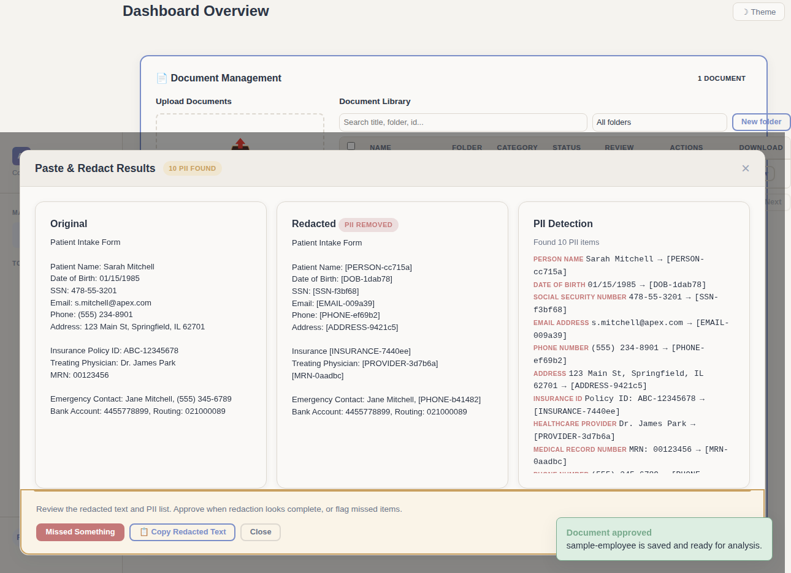

# How it works

Five steps from upload to clean file.

## Step 1: Upload your documents

Drag files into the app, click to browse, or point it at a folder on your machine. It handles PDFs, Word docs, plain text, HTML, and more.

## Step 2: Pick what to find

Choose from built-in patterns or create your own rules for company-specific identifiers. Toggle them on or off depending on what matters for your document.

## Step 3: Review the results

See your original text next to the redacted version. Every detected piece of PII is listed with its type. You know exactly what got caught before you download anything.

## Step 4: Catch what was missed

No detector is perfect. Highlight text the system missed, teach it what to redact next time, and build a library of custom rules as you go.

## Step 5: Download the clean version

Grab your redacted document in Markdown, the original format, or a clean redacted copy. Your original files stay untouched.

## Bonus: Quick redact — paste and go

No file to upload? Paste text directly into the app, hit redact, and get the cleaned version back in seconds. Nothing gets saved to disk.

