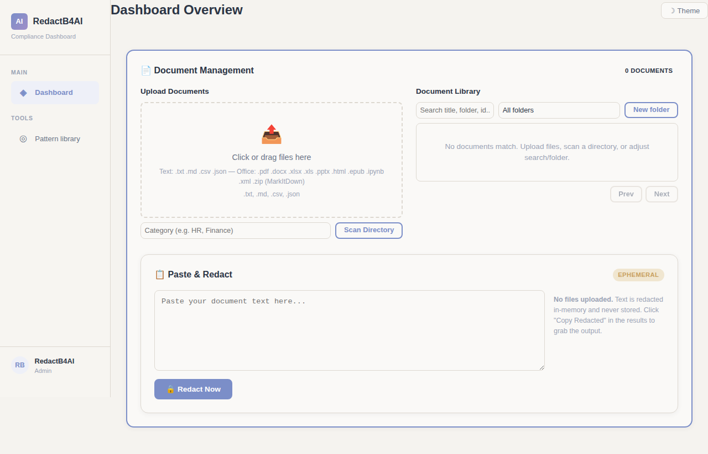

# What it does

Your documents probably contain more personal data than you think.

Names, email addresses, phone numbers, social security numbers, medical record IDs. They show up in places you would not expect: contract templates, shared spreadsheets, PDFs passed around the office. Once that data hits an AI model, you cannot take it back.

RedactB4X scans your documents for personally identifiable information, highlights everything it finds, and lets you redact it with a click. You decide what gets shared and what gets covered up.

It runs on your own machine or server. Your documents never leave your network.

## Key Features

### Drag-and-drop upload

Drop a file, click to browse, or point it at a whole folder. Handles PDFs, Word docs, text files, HTML, and more.

### Built-in PII patterns

Names, emails, SSNs, credit cards, IP addresses, medical IDs. Runs automatically on every document.

### Side-by-side review

See the original and redacted versions next to each other. Every detected item is listed with its type and replacement token.

### Custom pattern library

Save your own detection rules. Build them once, reuse them forever. Regex or exact text match.
